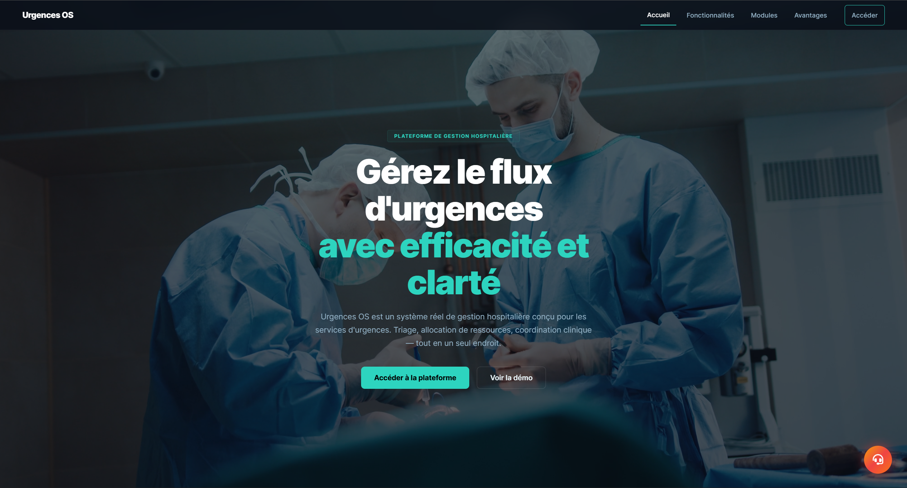
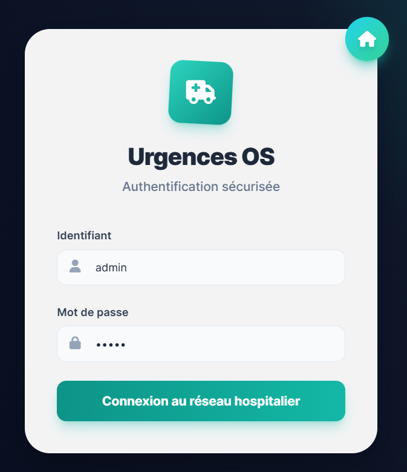
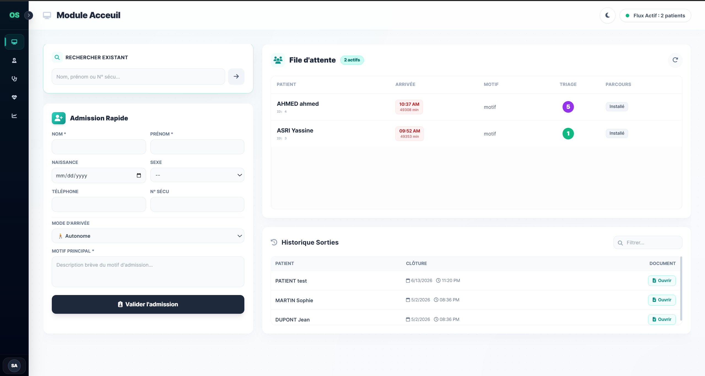
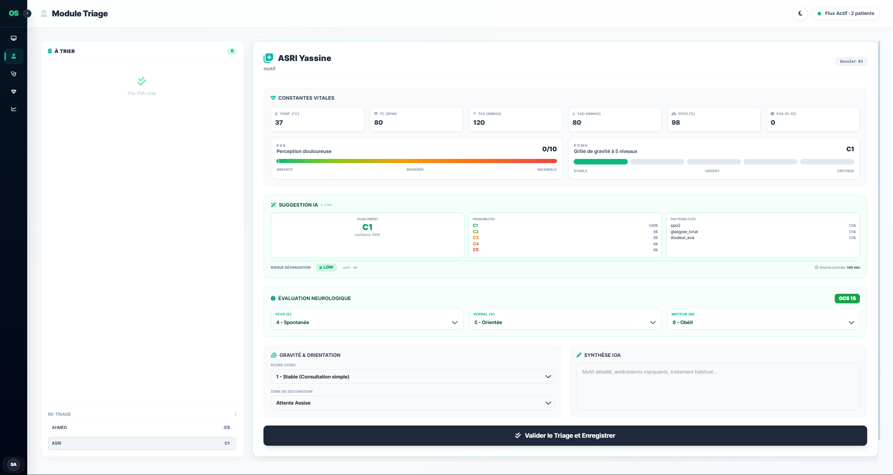
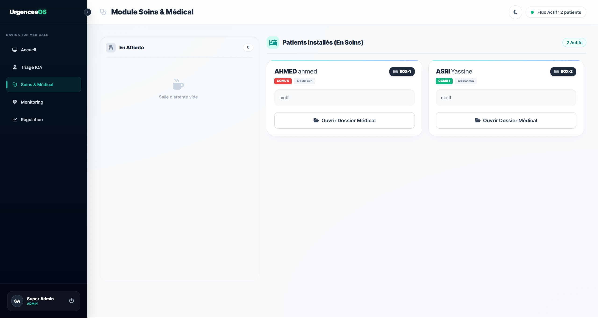
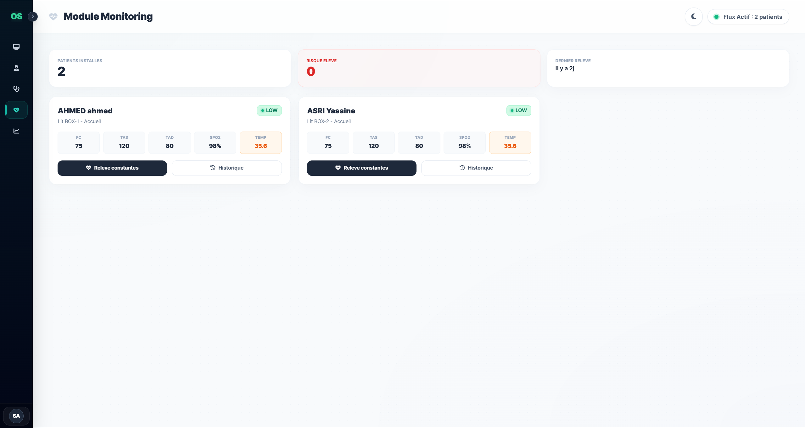
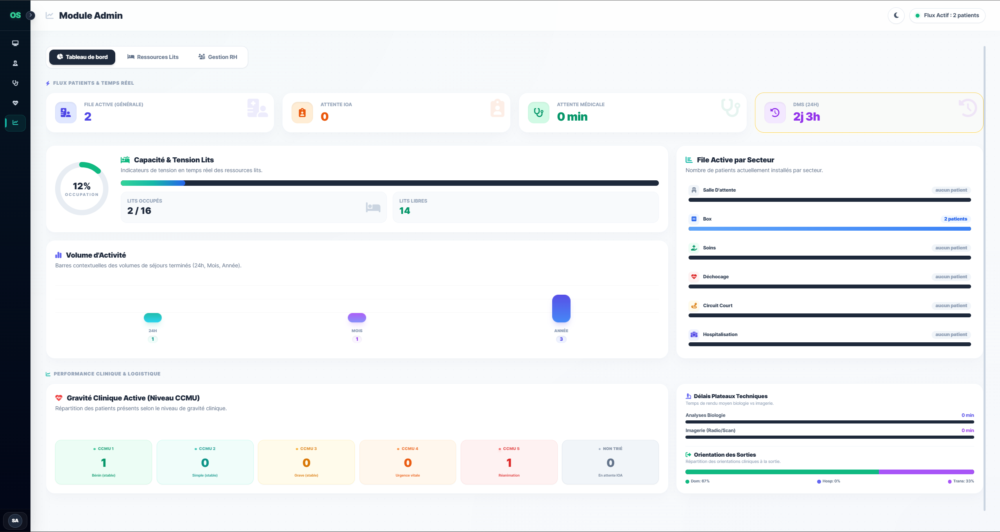
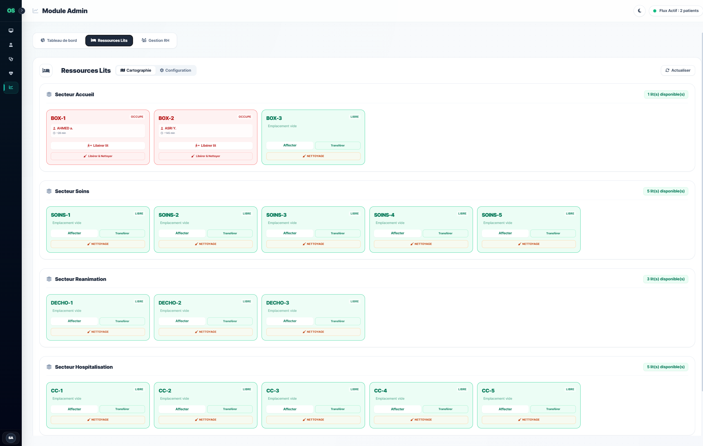
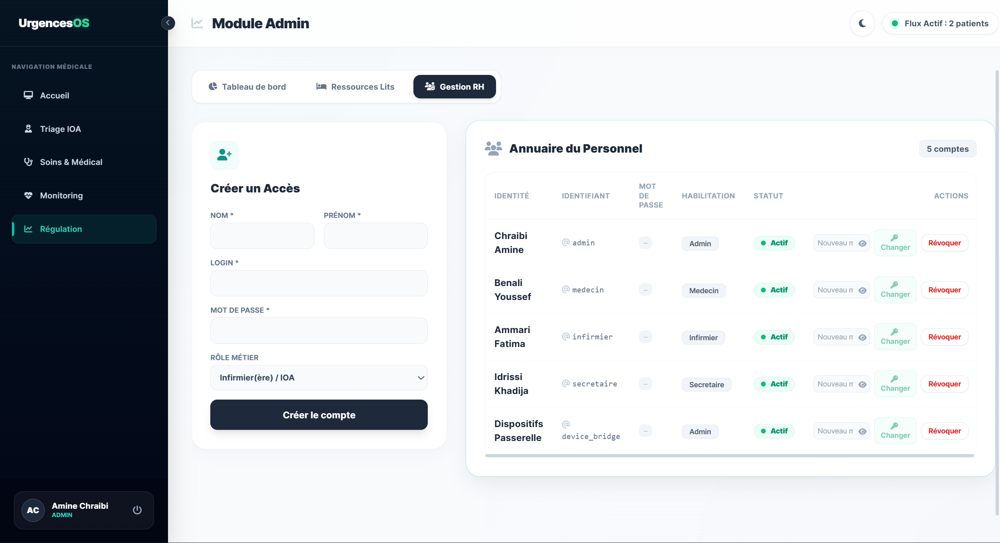

# 🏥 Urgences OS - Intelligent Emergency Triage & Hospital Flow Platform

[](https://fastapi.tiangolo.com)
[](https://www.python.org)
[](https://xgboost.readthedocs.io)
[](https://www.hl7.org)
[](https://websockets.readthedocs.io)
[](LICENSE)

**Urgences OS** is an end-to-end digital health engineering platform designed to optimize real-time patient flow, clinical triage, and bed allocation in hospital emergency departments.

The platform combines a **clinical AI predictive engine**, a **biomedical interoperability gateway (HL7 v2.5.1 ORU^R01)**, and a **real-time reactive WebSocket architecture**.

---

## 📸 Platform Interface Showcase

### 1. Welcome & Role-Based Authentication (RBAC)
| Landing Page & Overview | Multi-Role Login (Doctor, Nurse, Admin) |
| :---: | :---: |
|  |  |

---

### 2. Patient Flow & AI-Driven Clinical Triage
| Patient Admission & Waiting Queue | Clinical Triage & CCMU Prediction (XGBoost) |
| :---: | :---: |
|  |  |

---

### 3. Medical Records, Care & Continuous Monitoring
| Medical File, Prescriptions & Exams | Real-Time Patient Monitoring & Alerts |
| :---: | :---: |
|  |  |

---

### 4. Operations Dashboard, Bed Tracking & Administration
| Department KPI & Analytics Dashboard | Real-Time Interactive Bed Map |
| :---: | :---: |
|  |  |

| User Management & Staff Permissions |
| :---: |
|  |

---

## 🌟 Core Capabilities

* **⚡ Real-Time Supervision (WebSockets):** Instant bidirectional broadcast of clinical events (admissions, vitals updates, transfers, critical alerts) without manual page refreshes.
* **🩺 Healthcare Interoperability (HL7 v2.5.1):** Direct ingestion gateway for `ORU^R01` observation messages from bedside patient monitors (supporting `MSH`, `PID`, `PV1`, `OBR`, `OBX` segments with standard LOINC codes) and automated `ACK^R01` acknowledgments.
* **🧠 Clinical Decision Support by AI:**
  * **Automated CCMU Triage:** Clinical severity tier classification (levels 1 to 5) via **XGBoost**.
  * **Early Deterioration Detection:** Dynamic physiological risk scoring (inspired by the **NEWS2** score) for early warning of hemodynamic or respiratory instability.
  * **Deterministic Medical Guardrails:** Hard-coded medical rules (e.g. vital distress tier CCMU 5 floor if Glasgow <= 7 or SpO2 < 75%) strictly safeguarding model outputs.
* **🚑 Pre-Hospital Coordination (SAMU/EMS):** Mobile telemetry and medical summary transmission from ambulances before hospital arrival.
* **🛏️ Dynamic Bed & Room Management:** Live spatial tracking of triage boxes, resuscitation beds, and short-stay hospitalization units.
* **📋 Medical Traceability & Audit Log:** Complete event auditing conforming to healthcare data integrity and security standards.

---

## 🏗️ System Architecture

```
                                    +-----------------------------------------+
                                    |     Patient Monitors & Simulators       |
                                    |  (HL7 v2.5.1 ORU^R01 / MLLP Stream)     |
                                    +-----------------------------------------+
                                                         |
                                                         v
+-----------------------+           +-----------------------------------------+
| Healthcare Web Client |<=========>|          FastAPI Backend Server         |
|  (React SPA / Babel)  | WebSockets| - HL7 Interoperability Gateway (OBX)    |
|                       |  HTTP REST| - Clinical AI Inference Engine (XGBoost)|
+-----------------------+           | - Role-Based Access Control (RBAC)      |
                                    +-----------------------------------------+
                                                         |
                                                         v
                                    +-----------------------------------------+
                                    |       Relational Database / ORM         |
                                    |  (Patients, Visits, Vitals, Audit Logs) |
                                    +-----------------------------------------+
```

---

## 📁 Repository Structure

```text
├── app/
│   ├── models/            # SQLAlchemy ORM models (Patients, Visits, Beds, Vitals, etc.)
│   ├── routes/            # FastAPI API endpoints (Triage, Monitoring, HL7, Auth, SAMU)
│   ├── schemas/           # Pydantic data validation schemas
│   └── utils/             # Utilities and HL7 v2.5.1 parser/generator
├── docs/
│   └── screenshots/       # Platform interface screenshots
├── models/
│   ├── artifacts/         # Trained ML model artifacts (XGBoost, Wait Time, NEWS2)
│   ├── features.py        # Clinical feature engineering (Shock Index, Delta Features)
│   └── train_ccmu_v2.py   # Model training and validation pipeline
├── scripts/
│   ├── monitor_simulator.py   # Real-time multi-parameter monitor simulator (HL7)
│   ├── seed_device_bridge.py  # Biomedical gateway machine account initialization
│   └── import_medicaments.py  # Medication formulary importer
├── static/                # Frontend libraries, local fonts, and stylesheets
├── app.html               # Main hospital emergency coordination application
├── simulateur.html        # Interactive patient monitor simulator
├── run.py                 # FastAPI backend entrypoint
└── serve.py               # Static web server for frontend interfaces
```

---

## 🚀 Quickstart Guide

### 1. Prerequisites

* Python 3.10 or higher
* Git

### 2. Installation

```bash
# Clone the repository
git clone https://github.com/ysnmod/urgences-os.git
cd urgences-os

# Create and activate virtual environment
python3 -m venv .venv
source .venv/bin/activate  # On Windows: .venv\Scripts\activate

# Install dependencies
pip install -r requirements.txt
```

### 3. Database Initialization

```bash
# Initialize schema and default accounts
python3 -c "from app.models.base import Base, engine, upgrade_database; from app.routes.main import seed_data; Base.metadata.create_all(bind=engine); upgrade_database(); seed_data()"

# Create biomedical bridge machine account
python3 scripts/seed_device_bridge.py
```

### 4. Running the Platform

In two separate terminal windows:

* **Terminal 1: FastAPI Backend**
  ```bash
  python3 run.py
  # API live at http://127.0.0.1:8000 (Swagger docs: http://127.0.0.1:8000/docs)
  ```

* **Terminal 2: Web Frontend**
  ```bash
  python3 serve.py 3000
  # Main application: http://localhost:3000/
  # Patient monitor simulator: http://localhost:3000/simulateur.html
  ```

---

## 📡 HL7 Interoperability Gateway (ORU^R01)

Urgences OS exposes an endpoint for standardized biomedical telemetry ingestion:

* **Endpoint:** `POST /api/hl7/oru-r01`
* **Content-Type:** `text/plain` or `application/hl7-v2`
* **Sample Observation Message:**

```hl7
MSH|^~\&|MONITOR_PHILIPS_MP50|URGENCES_SIMULATOR|URGENCES_SERVER|CHU_HOSPITAL|20260814213500||ORU^R01|MSG20260814001|P|2.5.1
PID|1||PAT_12^^^URGENCES||EL_IDRISSI^Karim|||U
PV1|1|E|DECHO-1^URGENCES|||||||||||||||SEJ_12
OBR|1||MON_001|VITAL_SIGNS_PANEL^Vital Signs Monitoring^LN|||20260814213500
OBX|1|NM|8867-4^Heart rate^LN||88|/min|60-100|N|||F
OBX|2|NM|8480-6^Systolic blood pressure^LN||125|mm[Hg]|90-140|N|||F
OBX|3|NM|8462-4^Diastolic blood pressure^LN||78|mm[Hg]|60-90|N|||F
OBX|4|NM|2708-6^Oxygen saturation^LN||97|%|95-100|N|||F
OBX|5|NM|8310-5^Body temperature^LN||37.2|Cel|36.0-37.5|N|||F
OBX|6|NM|9279-1^Respiratory rate^LN||18|/min|12-20|N|||F
```

* **Automated HL7 Acknowledgment:**

```hl7
MSH|^~\&|URGENCES_SERVER|CHU_HOSPITAL|MONITOR|URGENCES_OS|20260814213501||ACK^R01|ACK20260814001|P|2.5.1
MSA|AA|MSG20260814001|Constantes vitales enregistrees avec succes pour sejour 12
```

---

## 👨‍💻 Author

**Yassine ASRI** - State Engineer in Digital Health Engineering  
*Higher School of Biomedical Engineering and Health Technologies (ESM6ISS) / UM6SS*  

---

## 📜 License

This project is licensed under the MIT License.
